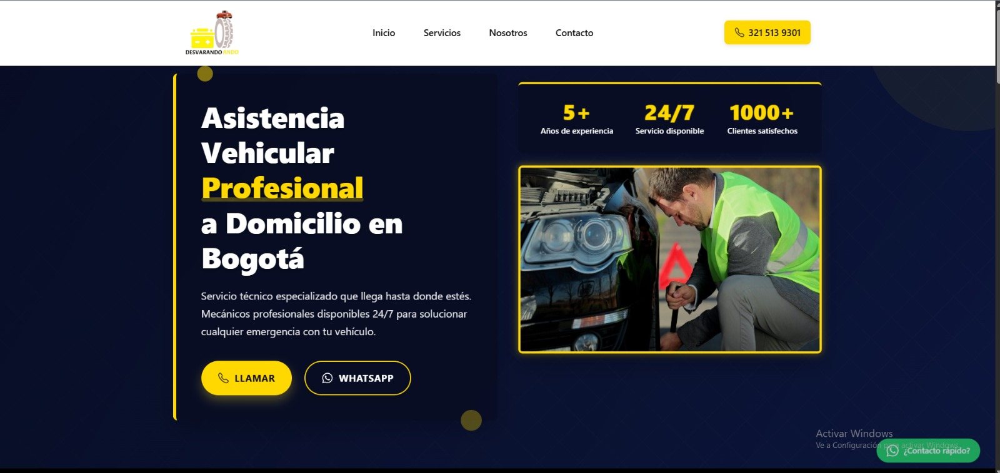

# DesvarandoAndo



## 📱 Descripción

DesvarandoAndo es una plataforma web que conecta a personas que necesitan asistencia vehicular en carretera con proveedores de servicios especializados. Ofrecemos soluciones rápidas y confiables para situaciones de emergencia vehicular, permitiendo a los usuarios encontrar ayuda profesional cuando más lo necesitan.

## 🛠️ Servicios en Bogota Colombia

- **Reinicio de baterías de vehículos** - Asistencia inmediata cuando la batería de tu auto falla
- **Venta de baterías para carros a domicilio** - Entrega e instalación de baterías nuevas a domicilio
- **Cambio de llantas** - Servicio de cambio de llantas ponchadas donde te encuentres
- **Cerrajería para autos** - Soluciones profesionales cuando olvidas las llaves dentro del vehículo

## ✨ Características

- Diseño totalmente responsive que se adapta a cualquier dispositivo
- Interfaz de usuario intuitiva y fácil de usar
- Sistema de geolocalización para encontrar servicios cercanos
- Plataforma de comunicación directa entre clientes y proveedores
- Valoraciones y reseñas para asegurar la calidad de servicio

## 🚀 Tecnologías utilizadas

- **Frontend**: React.js
- **Build Tool**: Vite
- **Estilos**: CSS3
- **Despliegue**: Vercel

## 📋 Requisitos previos

Para ejecutar este proyecto localmente, necesitarás:

- Node.js
- npm

## 🔧 Instalación y configuración

1. Clona este repositorio:
   ```bash
   git clone https://github.com/sergiopin22/DesvarandoAndo.git
   cd DesvarandoAndo
   ```

2. Instala las dependencias:
   ```bash
   npm install
   ```

3. Inicia el servidor de desarrollo:
   ```bash
   npm run dev
   ```

4. Abre tu navegador en `http://localhost:5173` (o el puerto que Vite indique)

## 🌐 Despliegue

Este proyecto está desplegado usando Vercel.

Para construir la aplicación para producción:

```bash
npm run build
```

Los archivos optimizados estarán disponibles en el directorio `dist/`.

## 👨‍💻 Desarrollador

- [Sergio Pinzón](https://github.com/sergiopin22) - Desarrollador principal


## 📄 Licencia

Este proyecto está licenciado bajo la Licencia MIT - ver el archivo [LICENSE](LICENSE) para más detalles.

---

Hecho con ❤️ para ayudar a quienes están varados en la carretera | © 2025 DesvarandoAndo